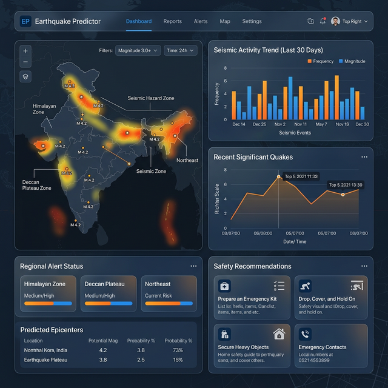

# 🌍 India Earthquake Predictor



A professional, state-of-the-art earthquake impact prediction system specifically designed for the Indian subcontinent. This project leverages **Machine Learning**, **Geospatial Data Science**, and **Real-time API integrations** to provide life-saving insights and safety recommendations during seismic events.

---

## 🚀 Key Features

### 🔍 Advanced Seismic Analysis
-   **Impact Probability Prediction**: Uses a **Random Forest Classifier** to estimate the likelihood of significant damage based on magnitude, depth, and distance.
-   **Intensity Estimation (MMI)**: Calculates the **Modified Mercalli Intensity** at the user's location using custom Ground Motion Prediction Equations (GMPE).
-   **Effective Magnitude**: Computes a localized "Effective Magnitude" to help users understand the shaking intensity relative to a local epicenter.
-   **Wave Arrival Estimation**: Provides real-time estimates for **P-wave** (Primary) and **S-wave** (Secondary/Damaging) arrival times to maximize reaction time.

### 🗺️ Dynamic Geospatial Intelligence
-   **Interactive Impact Maps**: High-fidelity maps powered by **Folium** that visualize:
    -   **Red Zones**: High-risk areas (Danger Zones).
    -   **Green Zones**: Low-risk/safe areas for evacuation.
    -   **Epicenter Tracking**: Pinpoint accuracy for seismic origins.
-   **Critical Infrastructure Discovery**: Dynamically fetches the 20 nearest **Hospitals** and **Open Grounds** (Parks/Playgrounds) within a 20km radius using **OSMNX** and OpenStreetMap data.

### 🌐 User-Centric Design
-   **Live Geolocation**: Integrated IP-based location services to automatically pinpoint your risk level without manual input.
-   **Comprehensive Safety Guides**: Actionable, risk-level specific recommendations (High/Moderate/Low) based on real-time data.
-   **Dual-Interface Deployment**: 
    -   **Django Backend**: A robust, full-stack implementation for long-term data management and user services.
    -   **Streamlit Dashboard**: A lightweight, fast-response diagnostic tool for immediate analysis.

---

## 🛠️ Technical Stack

-   **Backend**: Python, Django 5.0+
-   **Data Science**: Pandas, NumPy, Scikit-Learn (Random Forest)
-   **Geospatial**: Geopy, OSMNX, Folium, Geopandas
-   **Frontend**: Streamlit, HTML5, Vanilla CSS, Bootstrap (via Django)
-   **Machine Learning**: Pre-trained model using historical Indian earthquake catalogs.

---

## 📊 Data Pipeline & Management

The project includes a sophisticated internal pipeline for maintaining up-to-date seismic models:

1.  **`download_data`**: Fetches latest earthquake records from global catalogs (USGS/IRIS).
2.  **`preprocess_data`**: Cleans and normalizes geographical coordinates and magnitudes for the Indian region.
3.  **`generate_training_data`**: Augments data with distance and bearing calculations for ML training.
4.  **`train_model`**: Trains the Random Forest Classifier to ensure high-accuracy impact predictions.

---

## ⚙️ Installation & Setup

### 1. Repository Setup
```bash
git clone https://github.com/Abdurrehman510/India-Earthquake-Predictor.git
cd India-Earthquake-Predictor
```

### 2. Environment Configuration
```bash
python -m venv venv
source venv/bin/activate  # On Windows: venv\Scripts\activate
pip install -r requirements.txt
```

### 3. Model Initialization (Optional if pre-trained is available)
```bash
cd india_earthquake_predictor
python manage.py download_data
python manage.py preprocess_data
python manage.py generate_training_data
python manage.py train_model
```

---

## 🖥️ Usage

### Running the Web Server (Django)
```bash
python manage.py runserver
```
*Access at: `http://127.0.0.1:8000/`*

### Running the Dashboard (Streamlit)
```bash
streamlit run ../main.py
```
*Access at: `http://localhost:8501/`*

---

## 📜 License & Author

**Author**: [Abdurrehman510](https://github.com/Abdurrehman510)  
**Project**: India Earthquake Predictor  
**License**: MIT License

---
> [!IMPORTANT]
> This application is for informational purposes. In a real emergency, always follow the directions of local authorities and emergency services.
